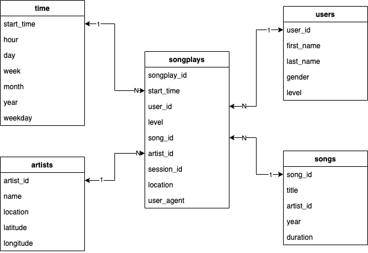

# Project 4 - Data Lake

## Introduction 
This project is the fourth one in the Data Engineering Nanodegree. This is an ETL pipeline for a data lake hosted on S3. It is needed to load data from S3, process the data into analytics tables using Spark, and load them back into S3. This Spark process is deployed on a cluster using AWS.

## Data
### Project Datasets

#### Song Dataset
The first dataset is a subset of real data from the [Million Song Dataset](http://millionsongdataset.com/). Each file is in JSON format and contains metadata about a song and the artist of that song. The files are partitioned by the first three letters of each song's track ID. For example, here are filepaths to two files in this dataset.

```
song_data/A/B/C/TRABCEI128F424C983.json
song_data/A/A/B/TRAABJL12903CDCF1A.json
```

And below is an example of what a single song file, `TRAABJL12903CDCF1A.json`, looks like.

```
{"num_songs": 1, "artist_id": "ARJIE2Y1187B994AB7", "artist_latitude": null, "artist_longitude": null, "artist_location": "", "artist_name": "Line Renaud", "song_id": "SOUPIRU12A6D4FA1E1", "title": "Der Kleine Dompfaff", "duration": 152.92036, "year": 0}
```

#### Log Dataset
The second dataset consists of log files in JSON format generated by this [event simulator](https://github.com/Interana/eventsim) based on the songs in the dataset above. These simulate app activity logs from an imaginary music streaming app based on configuration settings.

The log files in the dataset you'll be working with are partitioned by year and month. For example, here are filepaths to two files in this dataset.

```
log_data/2018/11/2018-11-12-events.json
log_data/2018/11/2018-11-13-events.json
```
And below is an example of what the data in a log file, `2018-11-12-events.json`, looks like.


## Data Lake Schema

This ETL process implements a star schema where ```songplays``` is the fact table and ```time```, ```artists```, ```songs```, and ```users``` are the dimensional tables.



### Fact tables

* ```songplays```. Records in log data associated with song plays.
    * ```songplay_id```
    * ```start_time```
    * ```user_id```
    * ```level```
    * ```song_id```
    * ```artist_id```
    * ```session_id```
    * ```location```
    * ```user_agent```

### Dimension tables

* ```users```. Users in the app.
    * ```user_id```
    * ```first_name```
    * ```last_name```
    * ```gender```
    * ```level```
* ```time```. Timestamps of records in ```songplays``` broken down into specific units.
    * ```start_time```
    * ```hour```
    * ```day```
    * ```week```
    * ```month```
    * ```year```
    * ```weekday```
* ```artists```. Artists in music database.
    * ```artist_id```
    * ```name```
    * ```location```
    * ```latitude```
    * ```longitude```
* ```songs```. Songs in music database.
    * ```song_id```
    * ```title```
    * ```artist_id```
    * ```year```
    * ```duration```